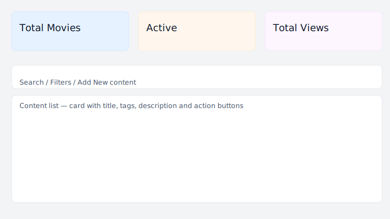
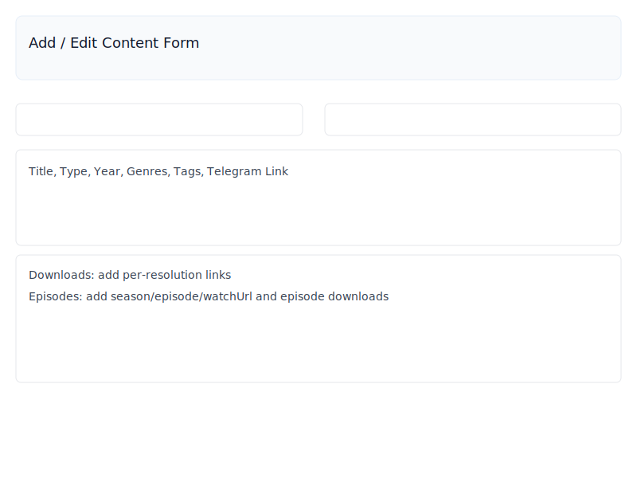

# ✨ SM Drama — Admin Guide (Friendly Step-by-Step)

Welcome! This guide walks you through every admin feature. It explains what each button and function does so you can manage the site confidently — no technical knowledge needed.

Table of contents
- Getting started: Logging in ✅
- Dashboard overview — quick stats 📊
- Content Management — search, filters, and actions 🗂️
- Add / Edit Content — step-by-step form 📥
- Episodes — manage series episodes 🎬
- Downloads — how to add mirrors and links ⬇️
- Users — admin user actions 👥
- Mobile & responsiveness — tips for phones 📱
- Troubleshooting & FAQs 🛠️
- Quick tips ✅

---

## 🔐 Getting started: Logging in
1. Open your browser and go to the admin page (example: `https://www.smdrama.org/login`).
2. Enter your admin email and password and click the Sign in button.
3. After successful login you'll arrive at the admin dashboard.

If you can’t log in:
- Check that you have an admin account. If not, ask the site owner to create one.
- Contact site owner if you forget your password.

---

## 📊 Dashboard overview
The dashboard shows quick, read-only cards that help you understand the site's health:
- Total Movies / Series — total content count
- Active — items currently visible to users
- Total Views — combined views across content

Use these numbers to get a quick sense of traffic and activity.

---

_Example: Dashboard showing quick stats and the content list._

## 🗂️ Content Management (list)
This is where you view, add, edit, feature, or hide movies and series.

Search & Filters
- Search box: Type a word or phrase to find content by title or description.
- Type filter: Choose `All`, `Movie`, or `Series`.
- Show Deleted: Toggle to view soft-deleted items.

Buttons on each content card
| Icon | Action | What it does |
|---|---|---|
| ⭐ | Featured | Toggle Featured state. Featured items are highlighted on the public site. |
| ✏️ | Edit | Open the edit form to change title, media, tags, episodes, downloads, etc. |
| 🗑️ | Delete | Soft-delete. The item is hidden from the site but kept in admin for recovery. |

Mobile behavior
- On phones, action buttons move below each content card so long titles won’t push buttons off-screen. Buttons remain easy to tap.

---

## 📥 Add / Edit Content (step-by-step)
Click `Add New Content` to create a new item, or click the pencil to edit an existing one.

Auto-fetching details
- You can paste an IMDb or TMDB URL into the Auto-fetch box and click `Fetch Data`.
- The system will try to fill Title, Year, Description, Poster, Trailer and other fields. Always verify and edit after fetching.

Required fields (must fill)
- Title — the movie or series name
- Type — `Movie` or `Series`
- Telegram Link — the link used when users click Watch (required)

Media fields
- Poster URL — image for the poster (JPG/PNG). If empty, a placeholder is used.
- Trailer URL — YouTube links will embed; MP4 links show a player.
- Backdrop URL — background banner image.

Downloads (new feature — very useful)
- Supported: 360p, 480p, 720p, 1080p.
- Each resolution can hold multiple links (add as many mirrors as you like).
- For each link you can write a small Source label (e.g., `Google Drive`) so users know where they’re going.
- Links are optional — don’t add anything you don’t want visible.
- There is no automatic link validation: double-check that links work before saving.

Tags & Genres
- Genres: free-text (comma-separated).
- Tags: select up to 5 from the provided options. Tags help users find related content.

Episodes (for series)
- Add Season number, Episode #, Watch URL (required), Title, Thumbnail, Duration.
- You can add episode-level downloads (same fields/format as movie downloads).
- Episodes added in the form are saved when you click Create/Update.

Saving
- Click `Create` (new) or `Update` (edit) to save.
- The form removes empty download slots automatically before saving.

_Example: Add / Edit Content form with fields for downloads and episodes._

Small note on a rare error
- If you ever see an error like "episodes Cast to Number failed", refresh the form and try again — this happens if the browser accidentally sends the wrong data type for a numeric field (it’s rare with the current form layout).

---

## 🎬 Episodes (management)
- Episodes show up on the public movie/series page and in the admin form.
- When users click an episode’s Watch button, the system records the view and updates the view counts for the episode and the parent movie.

---

## ⬇️ Downloads — how they appear and how to add them
Where they show
- On the public movie page there is a Downloads card (between Telegram links and the Overview). Each resolution with links appears with labelled links.
- Episode-level downloads appear under each episode.

How to add
1. In the admin edit/add form find the Downloads section.
2. Select the resolution (360/480/720/1080) and click Add Link.
3. Add a small Source label (optional) and the URL.
4. Save the form to publish the links.

Tip: Add at least one reliable mirror if you expect heavy downloads.

---

## 👥 Users (admin-only)
- Admins can create new users and set their role to `admin` or `client`.
- User management includes activating and deactivating accounts. Do not deactivate your own admin account accidentally.

---

## 📱 Mobile & responsiveness tips
- The admin UI is optimized for phones and tablets: dialogs stack vertically, content cards stack and buttons move below so nothing overflows.
- If a page looks off, try a hard refresh (Ctrl/Cmd+R) or clearing the browser cache.

---

## 🛠️ Troubleshooting & FAQs
Q: My downloads don’t show on the public page.
- A: Make sure you saved the movie/episode and wait a few seconds for caches to update. Also confirm the links are not empty.

Q: Images look broken on the public site.
- A: Verify the image URL points to a direct image file. Some hosts block external loading (hotlinking).

Q: The edit dialog doesn't fit my phone screen.
- A: The form is responsive and should stack fields; if it still looks wrong, try a browser refresh or test in another browser. If still error, please contact Developer.

Q: How can I restore deleted content?
- A: Use the `Show Deleted` toggle in Content Management to find soft-deleted items and re-activate them via Edit.

---

## ✅ Quick tips
- Always click Create/Update and wait for confirmation.
- Use the Fetch Data tool to speed up adding new items, but review fetched data.
- Label download links with a source name so users know which mirror they are picking.
- Keep tags consistent for better browsing.

